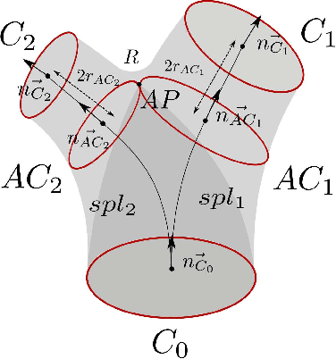
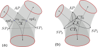
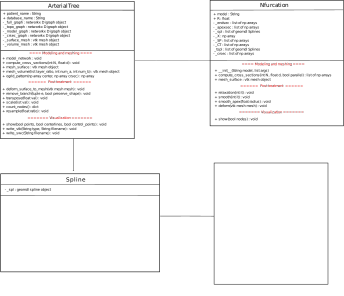
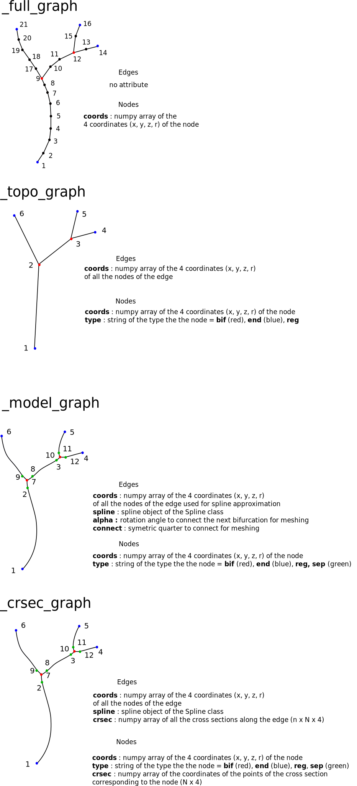

# Structured meshing of arterial trees

This code provide several tools to work with arterial network: 

- A data structure based on spatial graph that can be used to visualize and edit vascular trees
- A parametric modeling framework
- A meshing method to obtain high quality hexahedral surface and volume mesh
- A set of functions to interact with numerical simulation tool OpenFoam for computational fluid dynamics

## Installation

The code runs with python3.

1) Install the following python3 packages are required : **numpy, pyvista, matplotlib, math, goemdl, networkx, scipy.spatial, pickle **. They can be installed using pip3 or anaconda.

2) Clone the git repository `git clone git@gitlab.in2p3.fr:mdecroocq/meshing-arterial-tree.git`

## Example use

### Nfurcations

The Nfurcation class can be used to create a bifurcation hexahdral mesh. The bifurcations are modeled by a set of seven parameters as described by the illustration below (3 end cross sections, 2 apex cross section, 1 apex point, 1 radius of curvature for apex smoothing).
 

*Bifurcation model parameters*

`# Set parameters`

`end_sections = [np.array([[23.9598871 , 23.68382314, 30.86132581,  0.67195508], [ 0.78128613, -0.20870371, -0.58805789, -0.01492182]]), np.array([[25.66299566, 22.7253343 , 29.18165789,  0.59579125], [ 0.5452468 , -0.56835998, -0.60898994, -0.09383026]]), np.array([[26.28516204, 24.26930074, 29.93102134,  0.61640294], [ 0.89689347,  0.425852  , -0.11657413, -0.02535074]])]`

`apex_sections = [[np.array([[25.32911334, 23.09948612, 29.60329911,  0.65734002], [ 0.53181656, -0.52454216, -0.66040725, -0.07673932]]), [np.array([[25.71390248, 24.02351252, 30.03935879,  0.63252578], [ 0.90842008,  0.35094661, -0.22572994, -0.02560124]]])]`

`apex = [np.array([25.80793453, 23.54893934, 29.63189945])]`

`R =  0.5`

`# Create bifrucation`
 
`bifurcation = Nfurcation("crsec", [end_sections, apex_sections, apex, R])`

This automatically creates the bifurcation model and performs the geometric branch decomposition illustrated in the image below to prepare the meshing step.

*Bifurcation model geometric decomposition*

To create a surface mesh, the positions of the nodes of each cross section is first computed with the desired longitudinal density `d in [0, 1]` and number of cross section nodes `N` : 

`N = 24`

`d = 0.2`

`bifurcation.compute_cross_sections(N, d)`

Then, the surface mesh is produced by the method `mesh_surface`.

`mesh = mesh.surface()`

The produced mesh is a vtk mesh which can be saved or displayed using vtk or pyvista modules.

### Vascular networks
 
## Code overview

It is divided in four main classes:

**ArterialTree**: Vascular network object. Gathers functions to store, visualize, generate parametric model, apply post_treatments and mesh vascular trees from centerlines.

**Nfurcation**: Nfurcation object. Gathers functions to store, visualize, apply post_treatments and mesh bifurcations, trifurcations, nfurcations from a set of parameters. Used in ArterialTree.

**Spline**: Spline object with tools to evualuate the coordinates and derivatives and to approximate 3D data points. Used in ArterialTree and Nfurcation.

**Model**: Computation of the control points of the spline model. Used in Spline class.

**Simulation**: Interaction with openFoam simulation software via vtk for numerical simulation and result visualization.

*Spatial graph attributes of the ArterialTree class*
