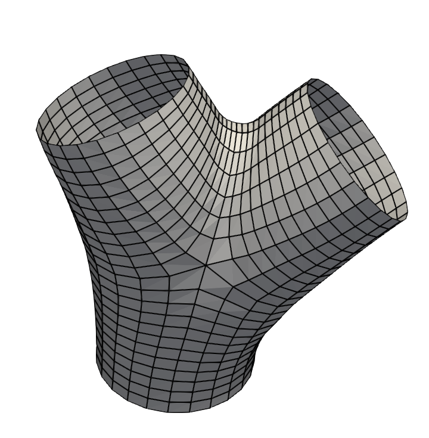
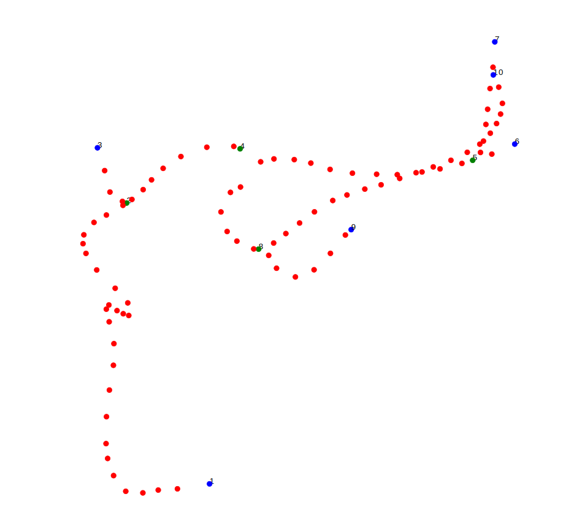
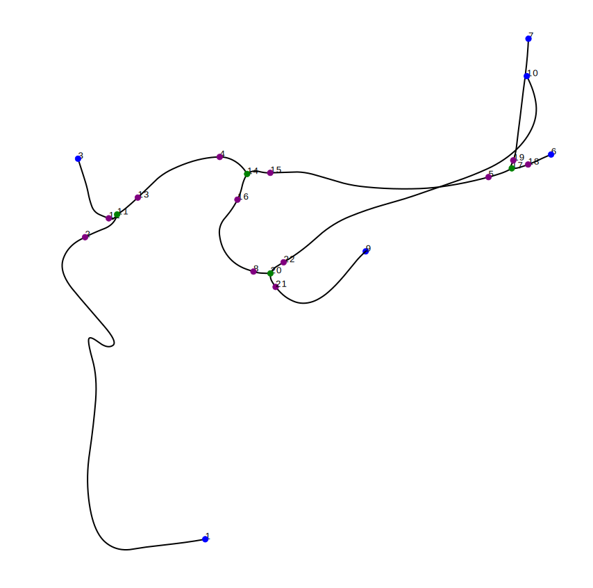
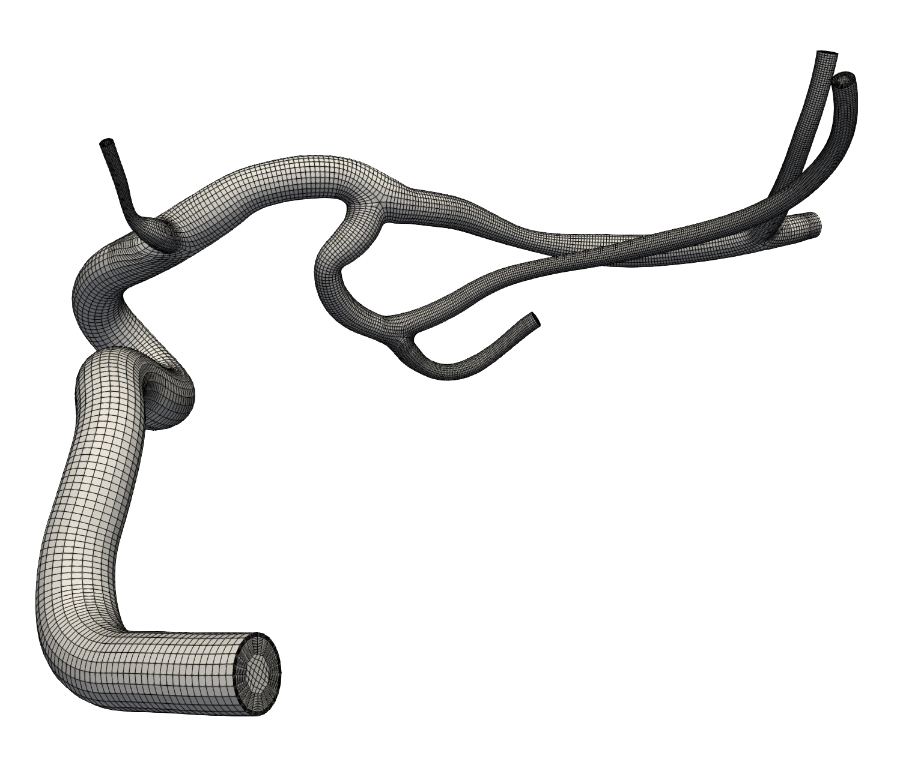
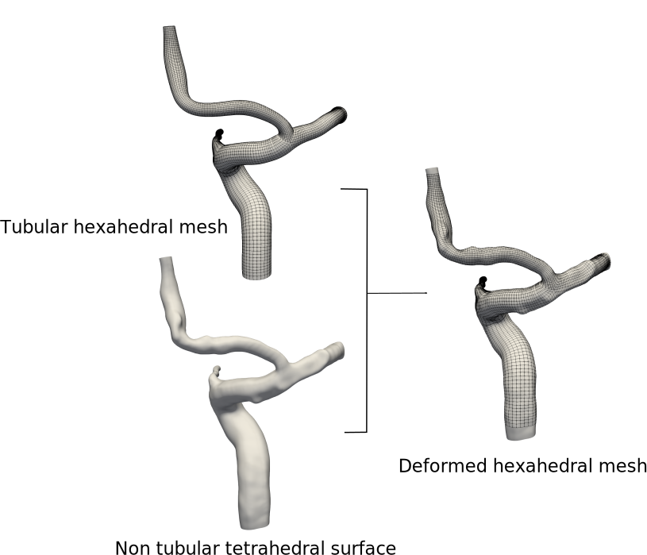

# Structured meshing of arterial trees

This code provide several tools to work with arterial network: 

- A data structure based on spatial graph that can be used to visualize and edit vascular trees
- A parametric modeling framework
- A meshing method to obtain high quality hexahedral surface and volume mesh
- A set of functions to interact with numerical simulation tool OpenFoam for computational fluid dynamics

## Installation

The code runs with python3.

1) Install the following python3 packages are required : *numpy, pyvista, matplotlib, math, goemdl, networkx, scipy.spatial, pickle*. They can be installed using pip3 or anaconda.

2) Clone the git repository `git clone git@gitlab.in2p3.fr:mdecroocq/meshing-arterial-tree.git`

## Example use

### Nfurcations

The Nfurcation class can be used to create a bifurcation hexahdral mesh. The bifurcations are modeled by a set of seven parameters as described by the illustration below (3 end cross sections, 2 apex cross section, 1 apex point, 1 radius of curvature for apex smoothing).
 

*Bifurcation model parameters*

`# Set parameters`

`end_sections = [np.array([[23.9598871 , 23.68382314, 30.86132581,  0.67195508], [ 0.78128613, -0.20870371, -0.58805789, -0.01492182]]), np.array([[25.66299566, 22.7253343 , 29.18165789,  0.59579125], [ 0.5452468 , -0.56835998, -0.60898994, -0.09383026]]), np.array([[26.28516204, 24.26930074, 29.93102134,  0.61640294], [ 0.89689347,  0.425852  , -0.11657413, -0.02535074]])]`

`apex_sections = [[np.array([[25.32911334, 23.09948612, 29.60329911,  0.65734002], [ 0.53181656, -0.52454216, -0.66040725, -0.07673932]])], [np.array([[25.71390248, 24.02351252, 30.03935879,  0.63252578], [ 0.90842008,  0.35094661, -0.22572994, -0.02560124]])]]`

`apex = [np.array([25.80793453, 23.54893934, 29.63189945])]`

`R =  0.5`

`# Create bifrucation`
 
`bifurcation = Nfurcation("crsec", [end_sections, apex_sections, apex, R])`

This automatically creates the bifurcation model and performs the geometric branch decomposition illustrated in the image below to prepare the meshing step.

*Bifurcation model geometric decomposition*

To create a surface mesh, the positions of the nodes of each cross section is first computed with the desired longitudinal density `d in [0, 1]` and number of cross section nodes `N` : 

`N = 24`

`d = 0.2`

`bifurcation.compute_cross_sections(N, d)`

Then, the surface mesh is produced by the method `mesh_surface`.

`mesh = bifurcation.mesh_surface()`

The produced mesh is a vtk mesh which can be saved or displayed using vtk or pyvista modules. For the given example, the resulting mesh is the following. 

*Surface mesh exemple*

The same code can be used to mesh coplanar trifurcation or n-furcations, by adding more sections.

### Vascular networks

Full vascular networks are modeled using the ArterialTree class, which relies on the Nfurcation class to mesh the bifurcations of the network. The input required is a set of nodes with spatial coordinates and radius (x, y, z, r) which respresents the vascular network of interest. Two format are accepted : *swc* and *vtk/vtp* format.
When an ArterialTree object is created, the centerline data is automatically loaded and stored in a graph structure. The name of the database and the name of the patient/case can be customized.

`file_path = Data/centerline.vtp`

`tree = ArterialTree("patient_test", "database_test", file_path)`

The network data can be visualized using the command `tree.show(True, False, False)`. The output of this command is given in the next figure.

*3D centerline data points*

The next step is the modeling step. It is performed by the `model_network` method : 

`tree.model_network()`
The parameters of the n-furcation of the network are automatically computed. The connecting vessels are represented with spline and the network is stored using a set of spatial graphs (see **Code overview** section). The spline model generated can also be visualized :

`tree.show(False, True, False)`

*Spline model of the vascular network*

In the same way we did for the Nfurcation class, we first compute the position of the nodes of the cross sections and then we can mesh the surface of the network using quad flow oriented faces. 

`N = 24`

`d = 0.2`

`tree.compute_cross_sections(24, 0.2)`

`surface_mesh = tree.mesh_surface()`

A volume mesh ready for numerical simulation can also be produced. The parameters of the internal grid is chosen by the user. The next image is an illustration of the volume mesh obtain from the red data points showed above.

`surface_mesh = tree.mesh_volume([0.2, 0.3, 0.5], 10, 10)`

*Spline model of the vascular network*

Many post-treatments of the networks are available. If you have a tetrahedral surface mesh and you want the tubular hexahedral mesh produced by the present code to match it, use the `deform_surface_to_mesh` method. Branches or vascular territories can easily be removed with the `remove_branch` method.

*Mesh deformation to match a given surface*

## Code overview

It is divided in four main classes:

**ArterialTree**: Vascular network object. Gathers functions to store, visualize, generate parametric model, apply post_treatments and mesh vascular trees from centerlines.

**Nfurcation**: Nfurcation object. Gathers functions to store, visualize, apply post_treatments and mesh bifurcations, trifurcations, nfurcations from a set of parameters. Used in ArterialTree.

**Spline**: Spline object with tools to evualuate the coordinates and derivatives and to approximate 3D data points. Used in ArterialTree and Nfurcation.

**Model**: Computation of the control points of the spline model. Used in Spline class.

**Simulation**: Interaction with openFoam simulation software via vtk for numerical simulation and result visualization.

*Spatial graph attributes of the ArterialTree class*
