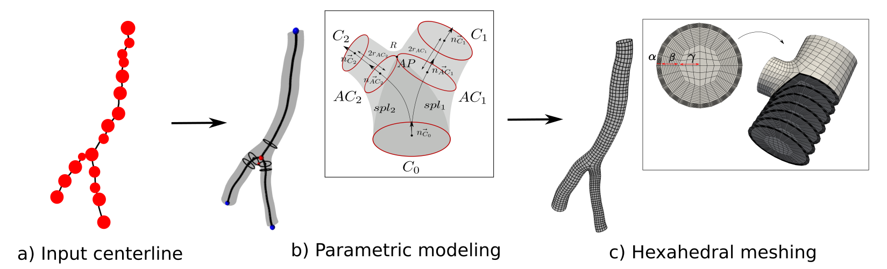
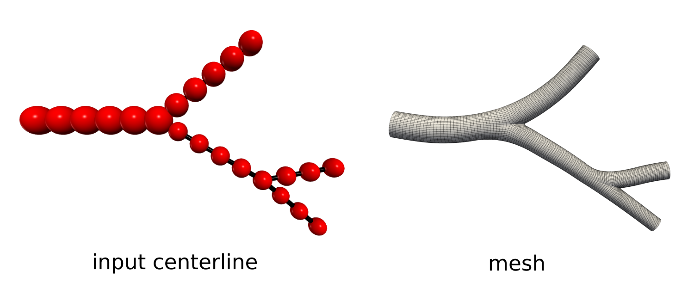
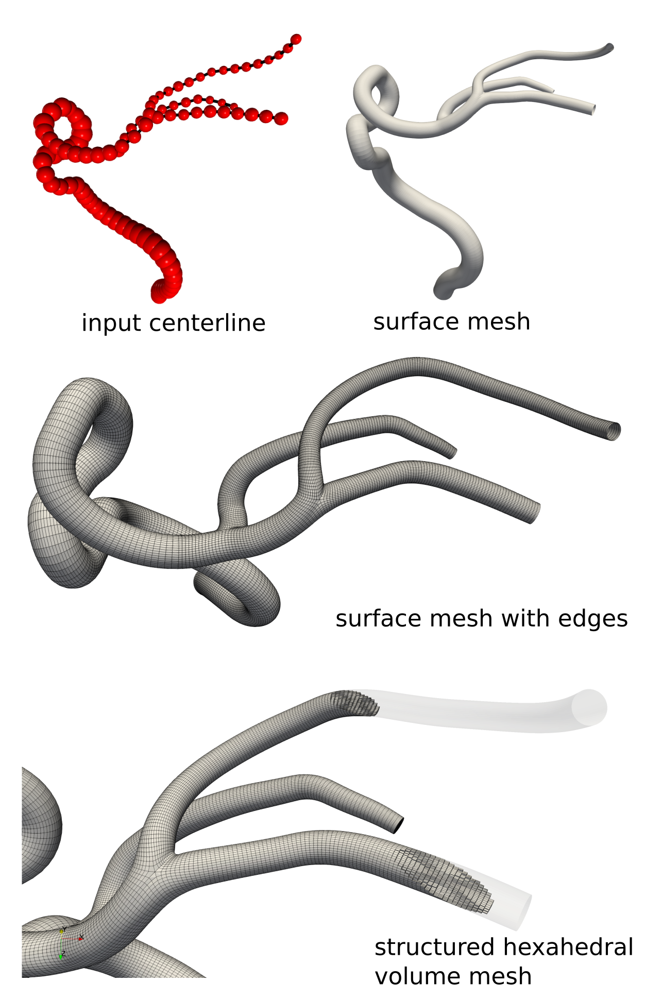
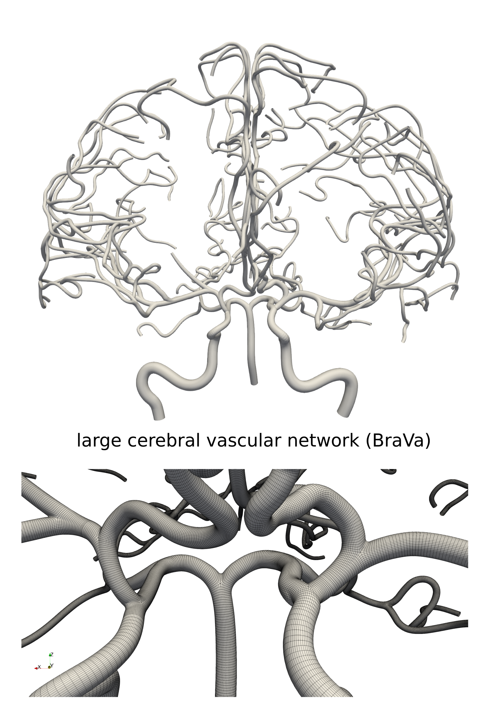
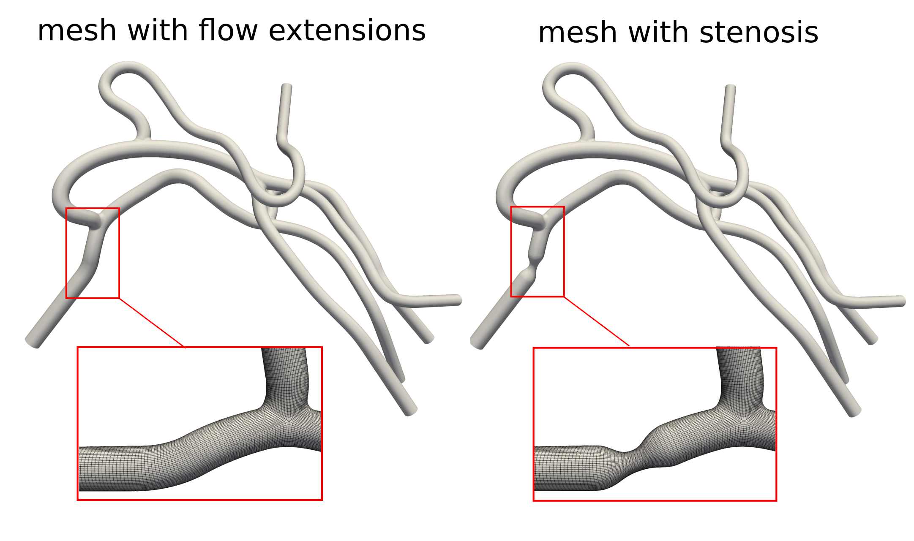
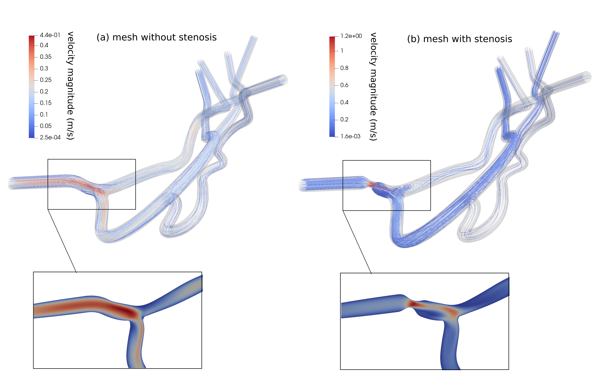
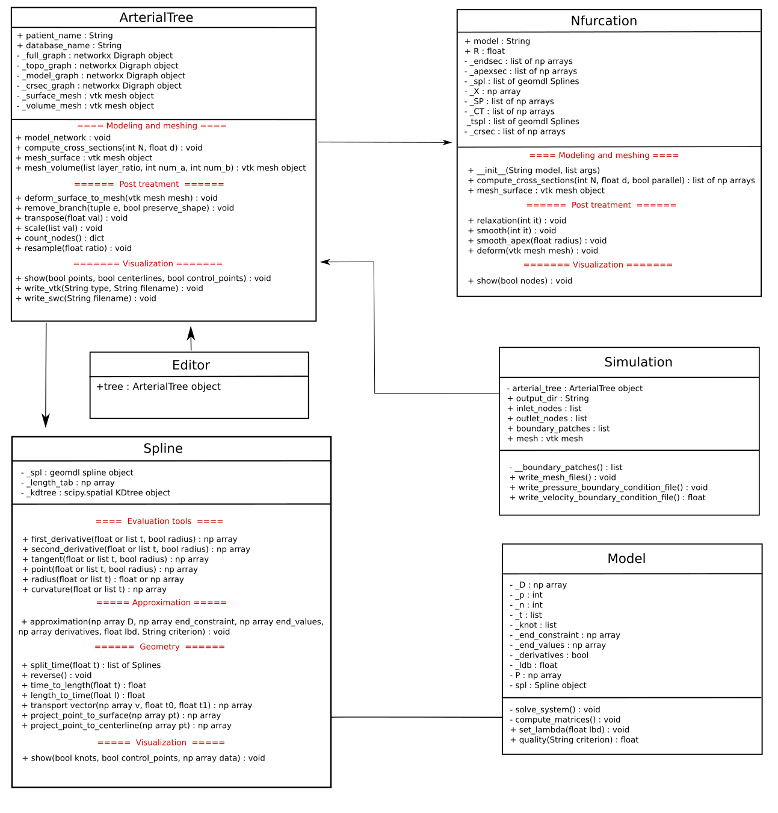
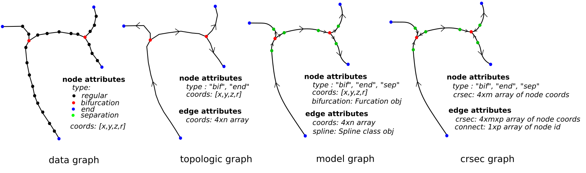

# Vascularmd : Structured hexahedral meshing for cerebral arterial trees

This code provide tools to edit, model and meshing vascular networks from centerlines. The purpose of this work is to facilitate the creation and the edition of meshes of vascular networks for computational fluid dynamics. The functionalities of this code includes:

- A parametric modeling framework to reconstruct a realistic continuous surface from the centerline data.
- A meshing method to obtain high quality hexahedral surface and volume mesh ready for CFD.
- A set of functions to facilitate the creation of models for CFD (flow extensions, conversion from VTK to OpenFoam case, automatic boundary definition)
- Storage of centerline data points in a graph structure to facilitate the visualization and edition of vascular trees using graph theory algorithms (dfs, neighbor identification...)
- A user interface enabling to visualize the result at every the step of the meshing process, edit the vascular network (modify the centerline data points, remove/add branch, change angle, add virtual pathology)

## Installation

The code runs with python3. To install, clone the git repository. The following python3 packages are required for the code to run : *numpy, pyvista, matplotlib, math, goemdl, networkx, scipy, pickle*.

This packages can be installed by:

1) Install them individually using pip3 or conda.
2) Run the script .sh `sh launcher.sh`
3) Via conda by creating a new environment from the .yml file provided `conda env create -f meshing.yml`

## Input data 

The input of the code is vascular network centerlines (data points (x,y,z,r) + connectivity information). Those centerlines can be imported from three formats.

1) The swc format (cf Data/example_centerline_ICA.swc)
2) The edge + node format (cf Data/example_centerline_ICA_edg.swc and Data/example_centerline_ICA_nds.swc)
3) The ideal model format that enables to mesh virtual models with straight branches (cf Data/ideal_model.txt)

More information on the input data can be found in the articles mentioned in the Citation section below.

## Limitations

The input centerlines must be directed (i.e the connectivity between data points must be oriented in the direction of blood flow). To obtain this type of centerlines directly from medical image (e.g. segmentation), please have a look at the code provided in the Others folder.

The code is originally intended for the meshing of cerebral vascular networks. The current version does not support complex bifurcation patterns such as non-planar multifurcations.

The quality of the mesh created depends on the input data, and meshing failure can happen in some cases. These failures can be corrected manually by editing the input data using the user interface provided in the code.

## Example use

The examples described below here can be run using the data files provided in the Data folder. The source code is provided in the main.py file.

### Arterial network meshing

This code can be used to create 3D surfaces from centerline data points only, even with few input data points, or noisy input. The result can be exported directly as a surface mesh with rectangular faces and as a volume mesh with structured, hexahedral cells for FEM/FVM numerical simulations. This meshing framework can be used to create automatically realistic meshes of ideal models with straight branches, as showed in the image below. This type of ideal model is easy to edit and can be used in CFD studies investigating the impact of branch angle on blood flow for instance.

The code can also enable to reconstruct patient-specific meshes suitable for numerical simulations as showed in the illustration below. This centerline-based method facilitates the editing process compare to segmentation-based methods enabling to reconstruct larger vascular networks.  

It can be used on existing databases of large cerebral vascular networks (e.g. BraVa) to mesh complex networks for the studies of pathologies such as ischemic stroke. 

### Pathology modeling and numerical simulation

For CFD studies, pathologies such as stenosis can be added to the vascular models from template shapes. Flow extensions can be automatically added the mesh faces classified for the setting of boundary conditions.

The created surface and volume meshes can be exported in vtk format, for visualization with paraview. For CFD purposes, the meshes can also be exported to a case folder for the OpenFoam software. Files for Ansys Fluent can be created from this format using the OpenFoam function `foamMeshToFluent`. The following image shows the results of the blood flow simulations, as velocity streamlines.

### Vascular network visualization and editing

To faciliate the visualization of vascular networks and edit it (e.g. move centerline points, remove branches, change angles, add pathologies, add flow extensions...) a user interface was developed. Theis interface includes the modeling and meshing methods proposed in the code + other visualization and editing functionalities. The interface can be launched from the class Editor (cf code main.py). Demonstration videos of the user interface are provided in the Documentation folder.

## Code overview

The code is divided in five main classes interconnected:

**ArterialTree**: Vascular network object. Gathers functions to store data, generate parametric model, apply post treatments and mesh vascular trees from centerlines. Used in Editor and Simulation.

**Nfurcation**: Nfurcation object. Gathers functions to store, apply post_treatments and mesh bifurcations, trifurcations, nfurcations from a set of parameters. Used in ArterialTree.

**Spline**: Spline object with tools to approximate the vessel trajectory from the input data points. Used in ArterialTree and Nfurcation.

**Model**: Computation of the control points of the spline model. Used in Spline.

**Simulation**: Interaction with openFoam simulation software for numerical simulation.

**Editor**: User interface for visualization and editing of vascular networks.

The data at the different stage of the meshing process are encoded in graphs. Four graphs are created, corresponding to the different steps of the process; data, topology, model, and mesh. The geometric and topological information (e.g centerline data points, model parameters, mesh nodes) are stored in the attributes of the nodes and edges of the graph, as showed in the image below. This storage method facilitates data manipulation and editing as it allows the use of graph theory-based algorithms.

## Citation 

If you use this code, please cite the following articles. 
 
**For the meshing framework :**
Decroocq, M., Frindel, C., Rougé, P., Ohta, M., & Lavoué, G. (2023). Modeling and hexahedral meshing of cerebral arterial networks from centerlines. Medical Image Analysis, 89, 102912.

**For the user interface :**

Méghane Decroocq, Guillaume Lavoué, Makoto Ohta and Carole Frindel, *A Software
to Visualize, Edit, Model and Mesh Vascular Networks*, 2022 44th Annual International
Conference of the IEEE Engineering in Medicine Biology Society (EMBC) Scottish Event
Campus, Glasgow, UK, July 11-15, 2022

